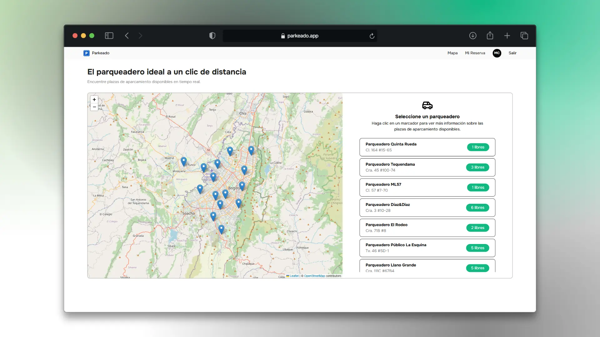
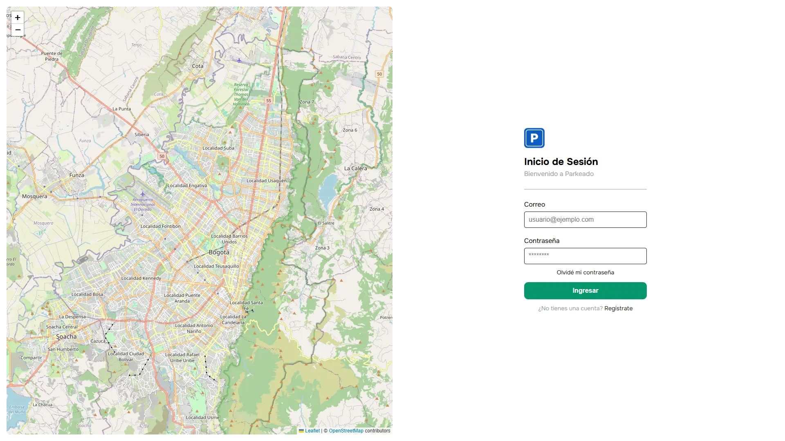
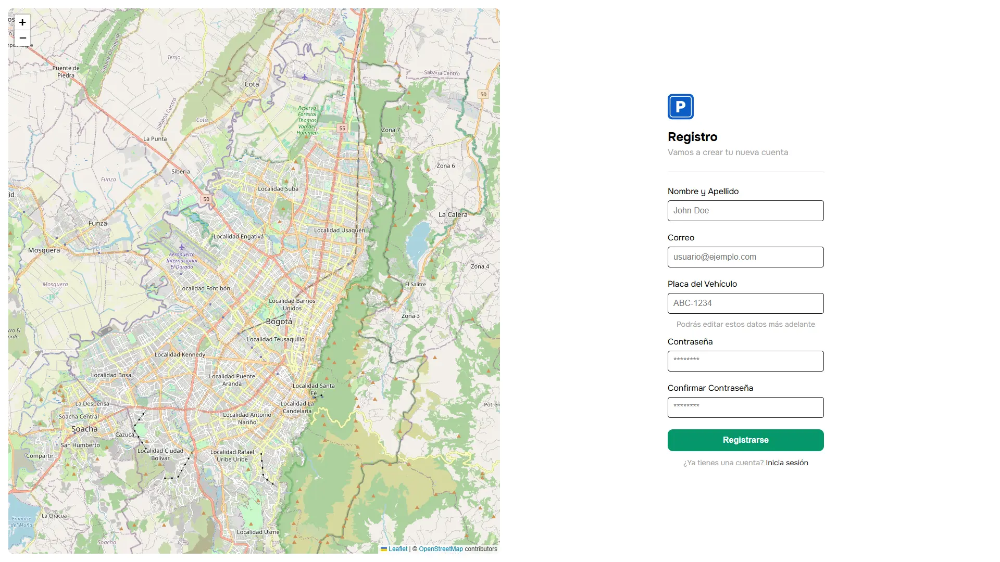
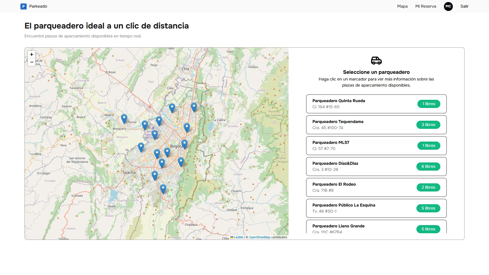
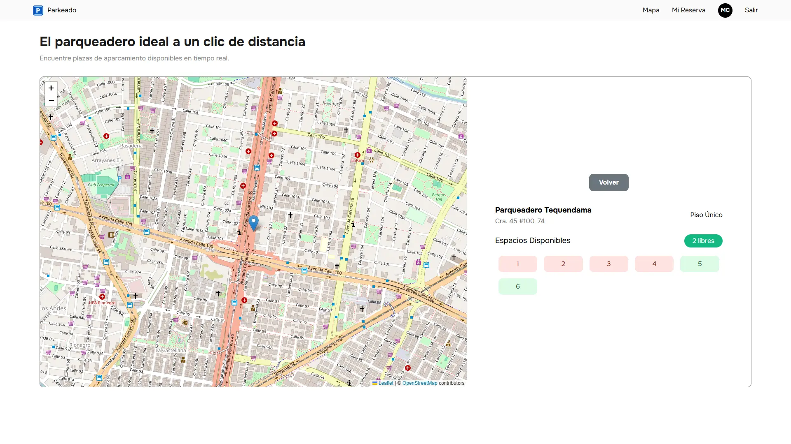
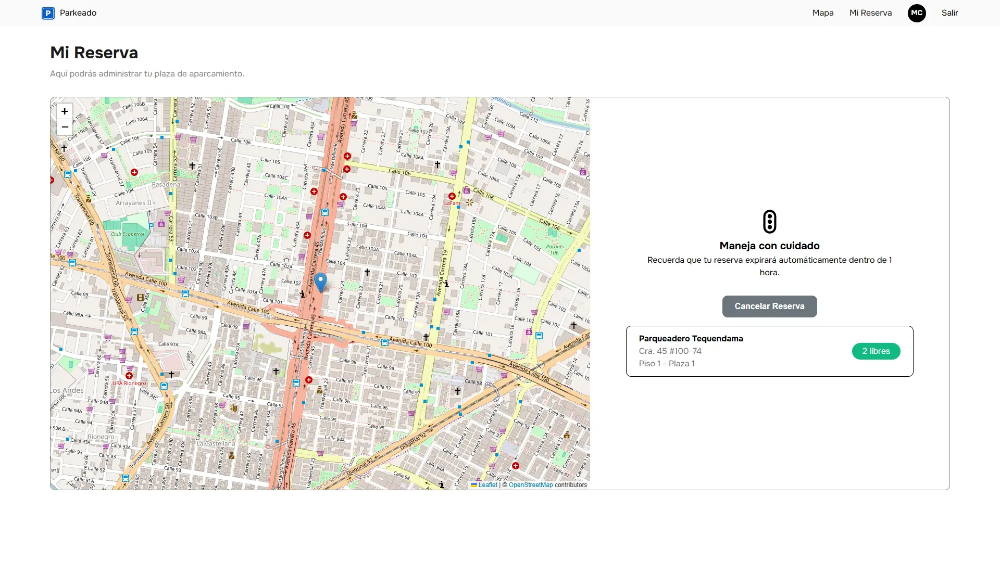
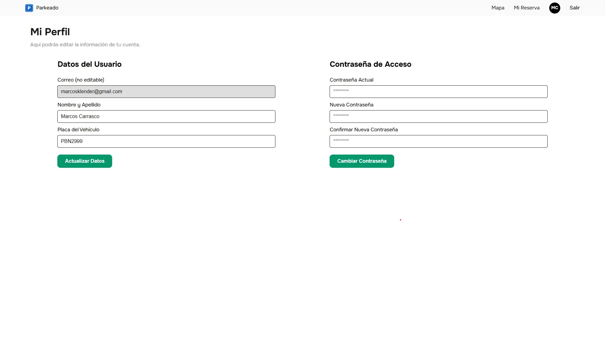
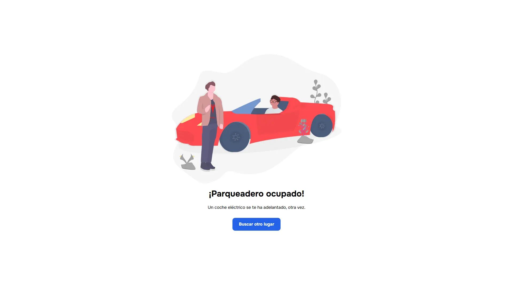

<h1 align="center">Parkeado</h1>

A real-time web application for finding, managing, and reserving parking lots and spaces.

## Table of Contents

  <ol>
    <li><a href="#about-the-project">About The Project</a></li>
    <li><a href="#features">Features</a></li>
    <li><a href="#screenshots">Screenshots</a></li>
  </ol>

## About The Project

Finding parking in busy urban areas can be a major source of stress and wasted time. Parkeado is a real-time web application designed to eliminate this friction by creating a seamless connection between drivers and available parking spots.

Born from a final thesis project, Parkeado provides users with a live overview of nearby parking facilities. Users can instantly check availability, view detailed information about the parking lot (such as available floors and specific vacancies), and reserve their spot directly from the app.

The primary goal is to simplify the urban parking experience, reducing traffic congestion and providing peace of mind for drivers heading to their destination.

<a href="#readme-top">Back to top ⬆️</a>

## Features

- **Real-Time Availability:** The core of the app. Parking spot availability is updated every 5 seconds, ensuring users have the most current information.

- **Interactive Map View:** Utilizes Leaflet.js to display all participating parking lots on an interactive map, making it easy to find locations.

- **Detailed Parking Info:** Select any parking lot to view crucial details, including its address, total floors, and the number of available spots on each floor.

- **Spot Reservation System:** Users can select and reserve a specific parking spot in advance, guaranteeing their space upon arrival.

- **Reservation Management:** A dedicated user dashboard allows for viewing and canceling active reservations.

- **User Authentication:** Secure login system to manage user-specific reservations and data.

- **Responsive Design:** A mobile-first interface ensures a smooth experience whether on a desktop or on the go.

<a href="#readme-top">Back to top ⬆️</a>

## Screenshots

### Login

### Register

### Home (Map)

### Parking Detail

### Reservation

### Profile

### Not Found

<a href="#readme-top">Back to top ⬆️</a>

